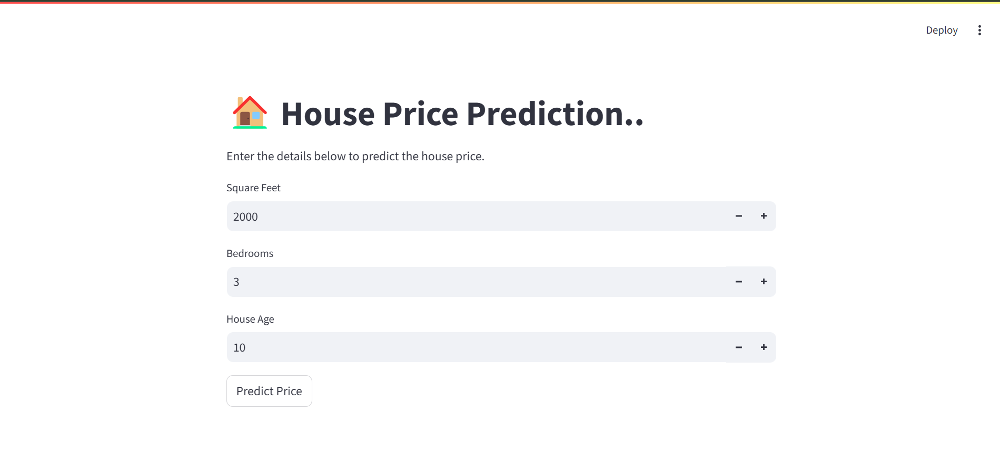
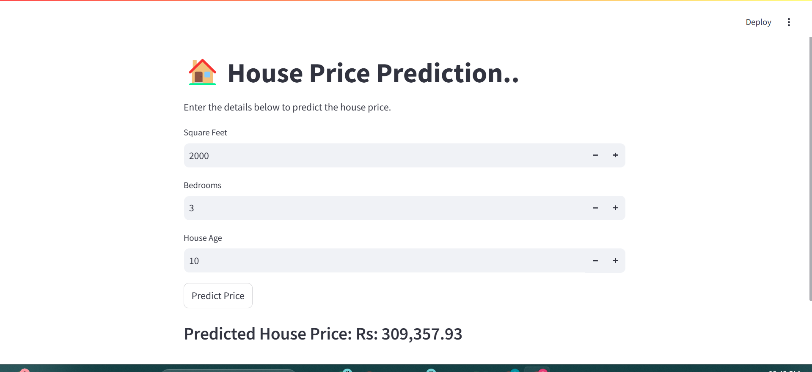

# 🏠 House Price Prediction Web Application

A data-driven web application that predicts house prices using a Linear Regression model. This interactive tool allows users to input features like square footage, number of bedrooms, and age of the property to receive an estimated price instantly.

---

## 📌 Project Overview

- Built a **machine learning regression model** to estimate housing prices based on historical data.
- Designed and deployed an **interactive web interface** using **Streamlit** for real-time predictions.
- Utilized a cleaned dataset (`house_prices_dataset.csv`) with key features influencing house prices.
- Employed **joblib** for model serialization, enabling fast and reusable predictions without retraining.

---

## 🎯 Key Features

- 💻 **Streamlit-Based UI**: Intuitive and user-friendly interface.
- 📥 **Dynamic Inputs**:
  - Square Feet (Area)
  - Number of Bedrooms
  - Age of the House (Years)
- 🤖 **Real-Time Predictions**: Price prediction updates instantly on button click.
- 💾 **Efficient Model Deployment**: Pre-trained model loaded using `joblib` for performance.
- 🧠 **Algorithm Used**: Linear Regression from `scikit-learn`.

---

## 📊 Technologies & Libraries Used

| Category        | Tools & Libraries                          |
|----------------|--------------------------------------------|
| Programming     | Python                                     |
| Data Handling   | Pandas, NumPy                              |
| Model Training  | Scikit-learn (LinearRegression)            |
| Visualization   | Matplotlib                                 |
| Deployment      | Streamlit                                  |
| Model Storage   | Joblib                                     |

---

## 🔍 Sample Prediction

**Input:**
- 🔹 Square Feet: `2000`
- 🔹 Bedrooms: `3`
- 🔹 Age: `10 years`

**Output:**
- 🎯 **Predicted House Price**: `₹ 48,00,000.00`*

## 📷 Interface Preview

### 📌 Screenshot

### 📌 Total Product Revenue by Month

